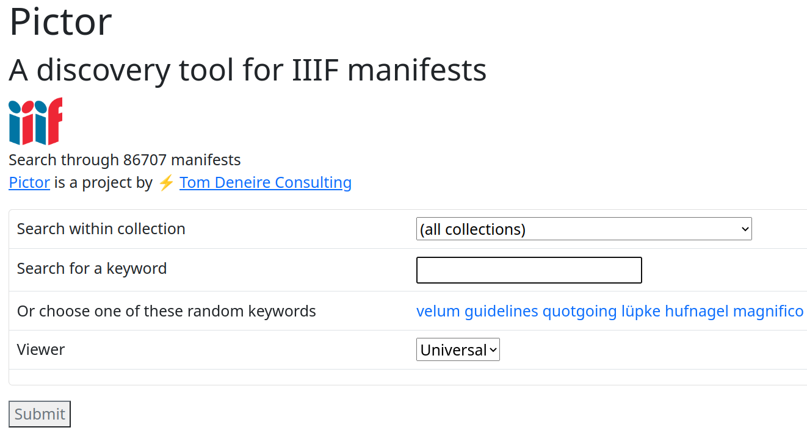

# Discovering IIIF Manifests with Pictor

<!--toc:start-->
- [Discovering IIIF Manifests with Pictor](#discovering-iiif-manifests-with-pictor)
  - [Idea](#idea)
  - [Harvesting](#harvesting)
  - [Indexing](#indexing)
  - [Web application](#web-application)
  - [Technical remarks](#technical-remarks)
  - [Wild plan and call to action](#wild-plan-and-call-to-action)
  - [See also](#see-also)
  - [Acknowledgements](#acknowledgements)
<!--toc:end-->



## Idea

Discovering [IIIF](https://iiif.io/) resources can be challenging.

Although the protocol does specify a dedicated [Discovery API](https://iiif.io/api/discovery/1.0/) it is not often implemented by institutions. (At [Anet](https://anet.be) we are guilty of the same). Moreover, this API has no straightforward way to obtain a full collection. It is certainly not as straightforward as with [OAI-PMH](https://www.openarchives.org/pmh/) for instance, that offers the verb `ListIdentifiers`.

The IIIF documentation does have an interesting [Guide to finding IIIF resources](https://iiif.io/guides/finding_resources/), which features a list of IIIF collections. Similar sources are:

- [IIIF Discovery Registry](https://registry.iiif.io/)
- [Biblissima IIIF Collections - Manuscripts & Rare Books](https://iiif.biblissima.fr/collections/)
- [Inventory of IIIF map collections](https://allmaps.org/)
- [Digitized Medieval Manuscript Database](https://digitizedmedievalmanuscripts.org/data#) (which allows for filtering by IIIF compliancy)
- [The IIIF Universe](https://graph.global/universes/iiif)

With that information I was able to scrape several of these collections and aggregate them into a corpus of about 6.5 million IIIF manifests. The resulting lists are available in this repository.

This repository has two purposes. One it offers a place to **store IIIF collections** and make them available for others. Two it uses those collections to host a [**discovery tool**](https://tomdeneire.github.io/pictor/) with a sample of them.

Currently, it features manifests of the following institutions / collections:

- [Allmaps](https://allmaps.org)
- [Anet library network](https://www.uantwerpen.be/en/projects/anet/)
- [Art Institute of Chicago](https://www.artic.edu/)
- [Badische Landesbibliothek Karlsruhe](https://www.blb-karlsruhe.de/)
- [Bayerische Staatsbibliothek (BSB) / Munich Digitization Centre (MDZ)](https://www.digitale-sammlungen.de/en/)
- [Biblioteca Apostolica Vaticana](https://www.vaticanlibrary.va/)
- [Biblioteca Digital de Cuba](http://iiif.sld.cu/)
- [Biblioteca Nacional de Portugal - Biblioteca Nacional Digital](https://bndigital.bnportugal.gov.pt/)
- [Biblioteca Virtual of the Banco de la República de Colombia](https://babel.banrepcultural.org)
- [BVMM (IRHT-CNRS)](https://bvmm.irht.cnrs.fr/) (* incomplete sample, due to connectivity issues)
- [Digital Bodleian](https://digital.bodleian.ox.ac.uk/)
- [Digital Collections (Leiden University Libraries)](https://digitalcollections.universiteitleiden.nl/)
- [Digital Commonwealth](https://digitalcommonwealth.org/)
- [Digitales Brandenburg - University Library Potsdam](https://digital.ub.uni-potsdam.de/)
- [Digitale Sammlungen Universität Bremen](https://brema.suub.uni-bremen.de)
- [Digitale Sammlungen Universität Bonn](http://digitale-sammlungen.ulb.uni-bonn.de)
- [Digitale Sammlungen Universität Düsseldorf](https://digital.ub.uni-duesseldorf.de)
- [Digitale Sammlungen Universität Frankfurt](https://digital.ub.uni-frankfurt.de)
- [Diözesan- und Dombibliothek Köln](https://dombibliothek-koeln.de/)
- [E-codices](https://e-codices.unifr.ch/en)
- [The Frick Collection](https://www.frick.org/)
- [Getty Institute](https://iiif.io/guides/guides/search.getty.edu/)
- [Göttinger Digitalisierungszentrum](https://manifests.sub.uni-goettingen.de/)
- [Gouda Time Machine](https://www.goudatijdmachine.nl/)
- [Harvard Art MUseums](https://harvardartmuseums.org/)
- [Iberoamerikanisches Institut Berlin](https://www.iai.spk-berlin.de/startseite.html)
- [IIIF Universe](https://graph.global/universes/iiif)
- [Internet Archive](https://archive.org/)
- [Universitätsbibliothek Heidelberg](https://www.ub.uni-heidelberg.de/)
- [Landesbibliothek Oldenburg Digital](https://digital.lb-oldenburg.de)
- [Manuscriptorium](https://manuscriptorium.com/)
- [Metropolitan Museum of Art Publications](https://www.metmuseum.org/art/libraries-and-research-centers/watson-digital-collections/metropolitan-museum-of-art-publications)
- [Mmmonk](https://www.mmmonk.be/)
- [Museum-digital](https://www.museum-digital.de/)
- [National Archives of Sweden](https://riksarkivet.se/)
- [Patrimonio Digital Complutense](https://patrimoniodigital.ucm.es/s/patrimonio/page/inicio)
- [Parker Library On the Web (Cambridge)](https://parker.stanford.edu/parker/)
- [Princeton University Library](https://figgy.princeton.edu)
- [Scholastic Commentaries and Texts Archive](https://scta.info/)
- [Staatsbibliothek Berlin](https://staatsbibliothek-berlin.de/en/)
- [Universitätsbibliothek Leipzig](https://www.ub.uni-leipzig.de/en/home/)
- [Universität Halle](https://digitale.bibliothek.uni-halle.de/)
- [University College Dublin Digital Library](https://data.ucd.ie/)
- [University of Toronto](https://collections.library.utoronto.ca/)
- [Villanova Digital Library](https://digital.library.villanova.edu/)
- [Wikidata](https://www.wikidata.org/)
- [Wellcome Collection](https://wellcomecollection.org/)
- [World Digital Library](https://www.loc.gov/collections/world-digital-library/about-this-collection/)
- [Yale Center for British Art](https://britishart.yale.edu/)
- [Yale Peabody Museum of Natural History](https://peabody.yale.edu/) (* incomplete in repository, due to lack of time)
- [Yale University Art Gallery](https://artgallery.yale.edu/)
- [Zeitungsportal NRW](https://zeitpunkt.nrw/)

(* = No sample in the discovery tool yet)

## Harvesting

Harvesting the IIIF manifests was done with Python scripts in a variety of ways.

Many institutions, like the [Bayerische Staatsbibliothek](https://www.digitale-sammlungen.de/en/) or the [University of Toronto](https://collections.library.utoronto.ca/) let you scrape collections from their Presentation API. Others, like [Digital Commonwealth](https://digitalcommonwealth.org/) have OAI-PMH that get you the necessary identifiers. Still others, like the [Getty Institute](https://iiif.io/guides/guides/search.getty.edu/) or [Wikidata](https://www.wikidata.org/) offer a SPARL endpoint.

I harvested all manifests I could find for the repository and also made random 1,000 manifest samples of the collections for the discovery tool. For this, good old Unix tools are still amazingly good:

```bash
sort digitalcommonwealth.txt | uniq | shuf | head -n 5000 > digitalcommonwealth_sample.txt
```

(Update 24 November 2022: at this point in the project, I was forced to switch from 5K to 1K samples from these collections, because of the sheer volume of the material. So at the moment the discovery tool's results are somewhat skewed because some collections are more represented than others. I plan to remedy this in the future with a full re-run, but it will be a while before I get round to this)

## Indexing

Requesting and indexing the IIIF manifests was done with a Go script (since Go is really strong for concurrency) and the result was piped as triple statements from stdout to a plain textfile. (I found this a handy alternative to having to set up a database like PostgreSQL or something similar that could handle concurrent writing).

The resulting triple store was then turned into a number of JSON files, including one for the IIIF manifest identifiers and their matching sequential number. I used base-85 numbers for the latter, as this gave me a very efficient way to encode large numbers.

In total, this process only takes a couple of hours for the current sample of ca. 80,000 manifests.

Workflow, after harvesting and sampling into *_sample.txt files

``` bash
mv *_sample.txt ../indexer/corpus
cd indexer
./build.sh
./pictor >> db.txt
python3 jsonify.py
```

## Web application

Finally, a [web interface](https://tomdeneire.github.io/pictor/) with some JavaScript allows to enter one or several keywords which are then looked up in the index. The resulting matches are presented as IIIF thumbnails, together with the manifest URL and the label metadata. A random selection of keywords is also present.

I also note that this is a completely serverless application, which hosts the necessary JSON statically and reads them into the browser memory upon loading the page. Obviously, this approach has its limitations, but, as with my [Ulpia](https://github.com/TomDeneire/ulpia) project, the benefits of not having to spin up a server for this tool outweigh the disadvantages.

## Technical remarks

- Not only do institutions seem to neglect IIIF discovery somewhat, several of the APIs I used, suffered frustrating hiccups like timeouts, refused connections or faulty resumption tokens. When I first started working on this, it seemed as if some collections even actively tried to limit scraping or crawling, but to be fair, there was usually a technical issue and several of the institutions I contacted, replied in a really constructive and helpful way.

- Parsing IIIF manifests (both version 2 and 3 manifests are current) with Go has taught me that a lot of institutions seem to implement their own interpretation of the API rather than follow the specifications. Mandatory fields are left out, fields have different data formats (strings instead of arrays and such), and so on.

- I did some experiments with SQLite as a database backend for this application and for the requesting/indexing phase. The first, inspired by the recent [sqlite3 WASM/JS](https://sqlite.org/wasm/doc/ckout/index.md) functionality, I just could not get up and running. The second, I found out, is not a viable option. Even if you insert data into SQLite concurrently with Go routines, SQLite apparently forces everything to sequential writing? Not sure about [this info](https://www.sqlite.org/threadsafe.html), though...

## Wild plan and call to action

Finally, some daydreaming. I made the discovery tool for a sample of the manifests I have collected, but what I would really like to do is push the limits and see how many manifests I can process and still host the index on a static webpage. Currently, for ca. 80,000 manifests, the JSON files are only slightly above 25 MB in total, so this could definitely be scaled up.

So if you or your instution want to participate in this experiment, or simply deposit your IIIF manifests in the central repository, please get in touch with me.

## See also

A very similar initiative to Pictor is the [Simple IIIF Discovery](https://research.ng-london.org.uk/ss-iiif/) by the National Gallery.

## Acknowledgements

Since first publishing this project, many people have reached out with kind comments and useful suggestions. As a result, Pictor has become a better and more comprehensive tool!

Special thanks go to [Etienne Posthumus](https://github.com/epoz), [Bob Coret](https://twitter.com/coret), [Alexander Winkler](https://github.com/alexander-winkler), [Glen Robson](https://github.com/glenrobson), [Jules Schoonman](https://sammeltassen.nl/), [Johannes Baiter](https://github.com/jbaiter), [Eduardo Fernández](https://orcid.org/0000-0001-9864-8734), [Mek](https://mek.fyi/), [Jörg Lehmann](@jrglmn@mastodon.social), [Jolan Wuyts](https://github.com/Hobbesball) and anyone else I might forget...
